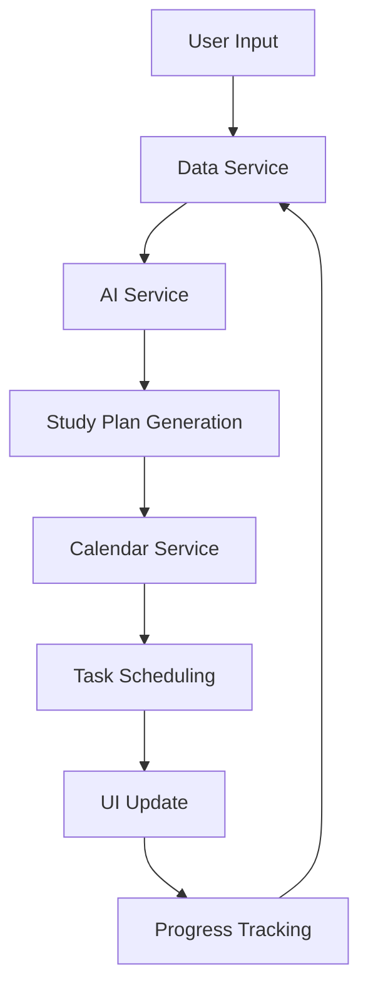

# Technical Design Document: AI-Powered Student Assistant

## System Architecture

### Overview
The application will follow a client-side architecture with local storage integration, utilizing modern web technologies and third-party services for AI capabilities.

### Technology Stack
- **Frontend Framework**: Vanilla JavaScript (ES6+) with potential for future framework integration
- **Styling**: CSS3 with CSS Custom Properties for theming
- **Storage**: LocalStorage for user data and preferences
- **Calendar**: FullCalendar.js library for calendar functionality
- **AI Integration**: OpenAI API for study plan generation
- **Date Handling**: date-fns library for date manipulations
- **UI Components**: Custom Web Components for reusability

### Directory Structure
```
/
├── index.html
├── assets/
│   ├── images/
│   └── icons/
├── styles/
│   ├── main.css
│   ├── components/
│   └── themes/
├── scripts/
│   ├── components/
│   ├── services/
│   ├── utils/
│   └── app.js
└── data/
    └── subjects.json
```

## Core Components Design

### 1. Data Models

#### Assignment
```typescript
interface Assignment {
  id: string;
  title: string;
  subject: string;
  dueDate: Date;
  targetGrade: number;
  proficiencyLevel: number;
  availableTime: {
    weekday: number;
    weekend: number;
  };
  studyPlan?: StudyPlan;
  progress: number;
}
```

#### StudyPlan
```typescript
interface StudyPlan {
  id: string;
  assignmentId: string;
  topics: StudyTopic[];
  totalHours: number;
  suggestedTechniques: string[];
  milestones: Milestone[];
}
```

#### Calendar Event
```typescript
interface CalendarEvent {
  id: string;
  title: string;
  start: Date;
  end: Date;
  subject: string;
  assignmentId: string;
  completed: boolean;
}
```

### 2. Component Architecture

#### Web Components
1. `<study-form>`: Assignment input wizard
2. `<calendar-view>`: Calendar interface
3. `<study-plan>`: Study plan display
4. `<progress-tracker>`: Progress tracking interface
5. `<dashboard-widget>`: Dashboard components

### 3. Service Layer

#### DataService
- Handles local storage operations
- Manages data persistence
- Provides CRUD operations for assignments and events

#### AIService
- Interfaces with OpenAI API
- Generates study plans
- Provides study techniques recommendations

#### CalendarService
- Manages calendar operations
- Handles event scheduling
- Resolves scheduling conflicts

#### ProgressService
- Tracks task completion
- Updates progress metrics
- Generates progress reports

### 4. State Management
- Implement a custom event-based state management system
- Use CustomEvents for component communication
- Maintain a central state store for application data

### 5. AI Integration

#### Study Plan Generation
1. Process user inputs
2. Generate structured prompts for OpenAI
3. Parse and structure AI responses
4. Create actionable study plans

#### Task Scheduling Algorithm
1. Calculate total study hours needed
2. Distribute hours based on available time
3. Consider task priority and deadlines
4. Avoid scheduling conflicts
5. Allow for breaks and rest periods

### 6. Data Flow



## Security Considerations

### Data Privacy
- All data stored locally
- No sensitive data transmission
- Secure AI API communication

### Error Handling
- Implement comprehensive error boundaries
- Provide user-friendly error messages
- Handle offline scenarios gracefully

## Performance Optimization

### Loading Strategy
- Lazy load components
- Implement progressive enhancement
- Cache AI responses

### Resource Management
- Optimize asset delivery
- Implement service worker
- Use resource hints

## Testing Strategy

### Unit Tests
- Component testing
- Service layer testing
- Utility function testing

### Integration Tests
- Component interaction testing
- Service integration testing
- State management testing

### E2E Tests
- User flow testing
- Calendar interaction testing
- Form submission testing

## Accessibility

### Requirements
- WCAG 2.1 AA compliance
- Keyboard navigation
- Screen reader support
- High contrast mode

## Browser Support
- Modern evergreen browsers
- Progressive enhancement
- Graceful degradation for older browsers

## Development Guidelines

### Code Style
- ESLint configuration
- Prettier formatting
- JSDoc documentation

### Git Workflow
- Feature branch workflow
- Semantic commit messages
- Pull request templates

## Deployment Strategy
- Static site hosting
- CDN integration
- Cache management